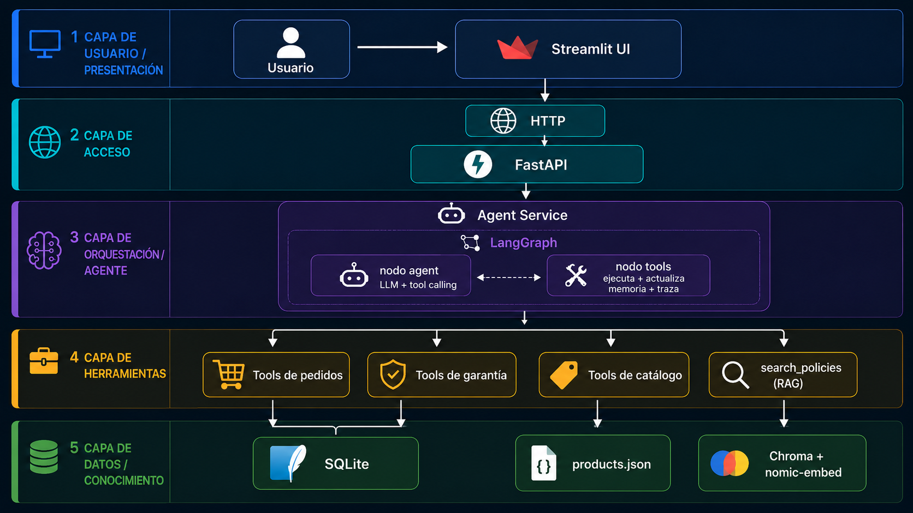

# Tecni - Agente IA para Retail de Electrónica

Tecni es un asistente conversacional para una tienda de electrónica. Atiende
ventas consultivas, seguimiento de pedidos, compras y garantías; mantiene memoria
de la sesión y escala a un asesor humano cuando el caso lo necesita.

La demo está pensada para correr con **Groq + `llama-3.3-70b-versatile`** porque
responde rápido y fue la configuración más estable para grabar el video. El
proyecto sigue siendo agnóstico al proveedor: si el endpoint es compatible con la
API de OpenAI, basta con cambiar las variables `LLM_*`. Dejé una opción local con
Ollama como fallback reproducible, pero la versión final del demo usa Groq.

## Idea principal

El punto más importante para este caso no es que el agente "suene inteligente",
sino que no invente datos del negocio: precios, stock, fechas de entrega, estados
de pedido, garantías o tickets.

Por eso la solución separa responsabilidades:

| LLM | Código determinístico |
|---|---|
| Conversa con el cliente | Valida datos de cliente |
| Extrae intención y entidades | Filtra y ranquea productos |
| Decide qué herramienta usar | Calcula vigencia de garantías |
| Redacta y justifica respuestas | Crea pedidos, tickets y reglas de escalamiento |

En otras palabras: el modelo le da naturalidad a la conversación, pero los hechos
importantes vienen de herramientas. Además, los evals revisan *grounding*: si el
agente menciona un precio, ID o ticket, debe poder rastrearse a un resultado de
herramienta. También hay una red determinística (`app/agent/price_guard.py`) que
corrige respuestas donde el modelo cambia por error un dígito de un precio o ID
que sí venía de una herramienta.

## Arquitectura



La aplicación tiene tres piezas principales:

- **Streamlit**: cliente delgado para la demo. Muestra el chat, la memoria de
  sesión y la traza de herramientas usadas.
- **FastAPI**: expone el endpoint de chat, inicializa datos y conecta la UI con
  el agente.
- **LangGraph**: orquesta el flujo del agente. El LLM decide si responde directo
  o llama herramientas; el nodo de herramientas ejecuta código determinístico y
  actualiza memoria/traza.

La información se guarda así:

- **SQLite** para clientes, pedidos, garantías y tickets.
- **`products.json`** para el catálogo, porque es estructurado y pequeño.
- **Chroma + embeddings** para políticas de garantía, envíos, devoluciones y FAQ.

No usé RAG para el catálogo a propósito: con pocos productos estructurados, es más
confiable filtrar y ordenar en código que pedirle al modelo que recupere productos
desde texto libre.

## Qué puede hacer

- Recomendar productos reales según necesidad, categoría y presupuesto.
- Comparar alternativas del catálogo.
- Consultar estado y fecha estimada de pedidos.
- Cambiar dirección de entrega cuando el pedido aún lo permite y el cliente es el
  titular.
- Registrar clientes nuevos con validación determinística.
- Crear pedidos y garantías.
- Crear tickets de garantía y escalar a humano ante fallas eléctricas, seguridad,
  reclamos legales, fraude o casos fuera de política.
- Responder preguntas de políticas usando RAG.
- Rechazar intentos de manipulación, descuentos no autorizados, formatos de salida
  inseguros y datos sensibles de tarjeta.

## Puesta en marcha

Requisitos:

- Python 3.12
- [`uv`](https://github.com/astral-sh/uv)
- Una API key de Groq para la ruta recomendada de demo.
- Ollama para embeddings locales del RAG (`nomic-embed-text`).

### 1. Instalar dependencias

**macOS / Linux**

```bash
make setup
```

**Windows**

```powershell
uv venv -p 3.12
uv pip install -e ".[dev]"
```

### 2. Preparar Ollama para embeddings

Aunque el chat de la demo usa Groq, el RAG de políticas usa embeddings locales con
Ollama.

```bash
ollama pull nomic-embed-text
```

Si quieres correr también el chat 100% local, descarga el modelo local:

```bash
ollama pull qwen3:14b
```

Para la ruta local conviene aumentar el contexto antes de iniciar Ollama:

```powershell
[Environment]::SetEnvironmentVariable('OLLAMA_CONTEXT_LENGTH','16384','User')
```

Luego reinicia la aplicación de Ollama.

### 3. Configurar variables de entorno

```bash
cp .env.example .env
```

Por defecto, `.env.example` viene preparado para Groq:

```env
LLM_BASE_URL=https://api.groq.com/openai/v1
LLM_API_KEY=gsk_your_groq_key_here
LLM_MODEL=llama-3.3-70b-versatile
LLM_DISABLE_THINKING=false
```

Reemplaza `LLM_API_KEY` por tu API key real. Para correr offline, comenta esa
sección y descomenta la alternativa local de Ollama en el mismo archivo.

### 4. Preparar datos

Estos comandos crean la base SQLite y construyen el índice Chroma. También se
ejecutan al iniciar la API, pero correrlos antes ayuda a detectar problemas de
entorno.

```bash
make seed
make index
```

En Windows sin `make`:

```powershell
python -m app.data.seed
python -m app.rag
```

### 5. Ejecutar la demo

En una terminal:

```bash
make api
```

En otra:

```bash
make ui
```

URLs:

- Backend: `http://localhost:8000`
- Docs de API: `http://localhost:8000/docs`
- UI Streamlit: `http://localhost:8501`

En Windows sin `make`:

```powershell
uvicorn app.main:app --reload
streamlit run ui/streamlit_app.py
```

## Pruebas y evaluación

```bash
make test   # 71 pruebas unitarias determinísticas, sin LLM
make eval   # 19 escenarios contra el agente real, con LLM
```

Las pruebas unitarias cubren validadores, herramientas, recomendador, memoria,
saneamiento de salida y guardrails determinísticos.

Los evals (`evals/`) prueban conversaciones completas. No comparan texto exacto;
revisan comportamiento:

- herramientas esperadas y herramientas prohibidas;
- escalamiento humano cuando corresponde;
- grounding de IDs y precios;
- checks semánticos con LLM-as-judge para casos como prompt injection,
  descuentos no autorizados o datos de tarjeta.

## Escenarios principales de la demo

1. **Venta consultiva**  
   "Necesito un portátil para diseño gráfico por menos de 5 millones"  
   El agente busca en catálogo, filtra por presupuesto y recomienda opciones
   reales.

2. **Comparación de productos**  
   "Compárame las dos primeras opciones"  
   Usa la herramienta de comparación y resume diferencias de precio/specs.

3. **Seguimiento de pedido**  
   "Quiero saber dónde está mi pedido. Mi identificación es 12345678"  
   Consulta el pedido más reciente del cliente y responde con estado y fecha.

4. **Garantía y escalamiento**  
   "Mi televisor dejó de encender y tiene garantía. Mi identificación es 12345678"  
   Valida cobertura, crea ticket y escala a humano por posible falla eléctrica.

5. **Compra segura**  
   Crea pedido, garantía y enlace de pago mock. Nunca pide número de tarjeta, CVV,
   PIN ni claves.

6. **Guardrails**  
   Rechaza descuentos inventados, no revela el prompt interno y no responde fuera
   del alcance de la tienda.

## Configuración

| Variable | Valor recomendado para demo | Descripción |
|---|---|---|
| `LLM_BASE_URL` | `https://api.groq.com/openai/v1` | Endpoint OpenAI-compatible |
| `LLM_API_KEY` | tu API key de Groq | Clave del proveedor |
| `LLM_MODEL` | `llama-3.3-70b-versatile` | Modelo de chat usado en la demo |
| `LLM_DISABLE_THINKING` | `false` | Déjalo en `false` para Llama; usa `true` solo con Qwen |
| `LLM_TEMPERATURE` | `0.2` | Baja variabilidad para tool calling más estable |
| `LLM_MAX_TOKENS` | `1024` | Espacio suficiente para tool calls y respuestas completas |
| `EMBED_MODEL` | `nomic-embed-text` | Embeddings locales para RAG |
| `EMBED_BASE_URL` | `http://localhost:11434` | URL de Ollama para embeddings |
| `SQLITE_PATH` | `app/data/retail.db` | Base transaccional |
| `CHROMA_PATH` | `app/data/chroma` | Índice vectorial de políticas |

## Modelo usado y alternativa local

| Configuración | Uso recomendado | Latencia aproximada |
|---|---|---|
| Groq `llama-3.3-70b-versatile` | Demo y evaluación principal | ~0.5-2 s por turno |
| Ollama `qwen3:14b` | Fallback offline/reproducible | ~90 s por turno en mi equipo |

La versión final del demo usa Groq + Llama. La opción local queda documentada para
mostrar que la arquitectura no depende de un proveedor único.

## Estructura del proyecto

```text
app/
├── config.py            # configuración tipada
├── main.py              # FastAPI; prepara DB e índice al arrancar
├── api/                 # rutas y schemas HTTP
├── agent/
│   ├── graph.py         # LangGraph: nodo agent + nodo tools
│   ├── service.py       # ejecuta un turno y arma respuesta/memoria/traza
│   ├── llm.py           # único punto provider-aware
│   ├── prompts.py       # rol, reglas de negocio y guardrails
│   ├── toolset.py       # schemas y dispatch de herramientas
│   ├── memory.py        # memoria estructurada de sesión
│   ├── price_guard.py   # corrige precios/IDs mal citados
│   └── trace.py         # traza de decisiones por turno
├── tools/               # customer / catalog / order / warranty / policy / escalation
├── domain/              # validadores y recomendador determinístico
├── rag.py               # indexación y búsqueda de políticas
└── data/                # schema.sql, seed.py, products.json, policies/*.md
ui/streamlit_app.py      # UI de demo
evals/                   # escenarios, grounding y juez semántico
tests/                   # pruebas unitarias
```

## Limitaciones conocidas

Estas son decisiones de alcance para mantener la prueba limpia y entregable:

- No hay autenticación real. Para el mock, conocer una identificación basta para
  consultar pedidos/garantías. Cambiar dirección sí verifica titularidad.
- La memoria vive en el proceso de la API. En producción iría a Redis o Postgres.
- La app está pensada para un solo proceso de demo; no incluye rate limiting ni
  multi-worker.
- La API re-siembra SQLite al arrancar para que la demo sea reproducible. En
  producción eso estaría detrás de una bandera y nunca tocaría datos reales.
- El RAG usa embeddings locales vía Ollama, incluso cuando el chat corre con Groq.

## Posibles siguientes pasos

- Persistir memoria y checkpointer en Redis/Postgres.
- Usar `interrupt()` de LangGraph para un handoff humano real.
- Agregar autenticación, rate limiting y observabilidad.
- Activar streaming de tokens en la UI.
