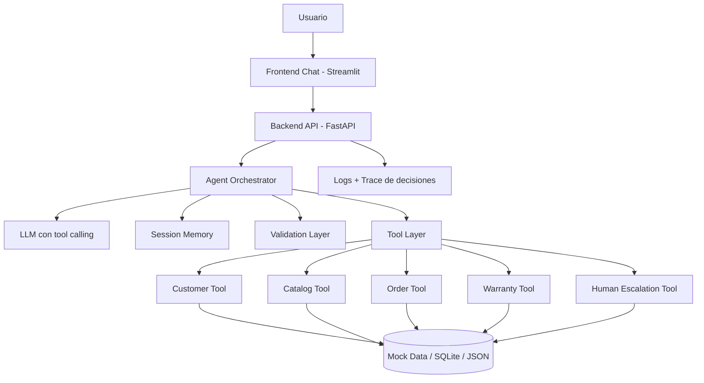

# Prueba Técnica

# Agente IA — Retail Electrónica

**Duración:** 15–17 horas  
**Formato final:** Código + Video del demo

---

## 1. Contexto del negocio

Una empresa del sector retail especializada en productos electrónicos —celulares, computadores, televisores y accesorios tecnológicos— requiere desarrollar un agente inteligente de atención al cliente para sus canales digitales.

El objetivo del agente es asistir a los clientes durante el proceso de compra y postventa, utilizando inteligencia artificial generativa y herramientas integradas para resolver solicitudes de forma autónoma.

---

## 2. Gestión de clientes

### Tipos de clientes

- **Clientes nuevos:** requieren registro y validación de datos.
- **Clientes frecuentes:** requieren validación de identificación previamente registrada.

### Validación de datos — cliente nuevo

| Campo | Regla de validación | Notas |
|---|---|---|
| `identificación` | 4–11 dígitos numéricos | No debe existir previamente en el sistema |
| `nombre_completo` | 1–100 caracteres | Solo letras, espacios, tildes y ñ |
| `telefono` | Exactamente 10 dígitos | Debe iniciar en 3 o 6 |
| `correo` | Formato email válido | Debe contener `@` |

---

## 3. Capacidades conversacionales

El agente debe:

- Mantener conversaciones naturales y fluidas.
- Conservar contexto a lo largo de la sesión.
- Adaptar el tono según el perfil del cliente.
- Responder usando respuestas naturales.

---

## 4. Herramientas disponibles para el agente

El agente debe decidir dinámicamente cuándo invocar herramientas. Las herramientas pueden ser simuladas mediante mock functions con datos hardcoded.

### Ventas

- Consultar catálogo de productos y precio.
- Comparar productos.
- Recomendar productos según necesidad del cliente.

### Pedidos

- Consultar estado del pedido.
- Consultar fecha estimada de entrega.
- Actualizar dirección de entrega.

### Garantías y soporte

- Consultar estado de garantía.
- Registrar solicitudes de garantía.

---

## 5. Memoria y contexto

El agente debe recordar información relevante durante la conversación:

- Nombre del cliente.
- Productos consultados en la sesión.
- Presupuesto mencionado.
- Último pedido consultado.
- Preferencias expresadas por el usuario.

---

## 6. Inteligencia del agente

El agente debe ser capaz de:

- Decidir cuándo responder directamente sin invocar herramientas.
- Decidir cuándo ejecutar herramientas para resolver la solicitud.
- Pedir aclaraciones si falta información para proceder.
- Evitar inventar información como precios, fechas o stock.
- Reconocer cuándo debe escalar la conversación a un humano.

---

## 7. Escenarios mínimos a soportar

### Escenario 1 — Venta consultiva

> “Necesito un portátil para diseño gráfico por menos de 5 millones.”

El agente debe:

- Identificar la necesidad técnica del cliente.
- Invocar herramienta de catálogo y consulta de precios.
- Recomendar opciones justificando cada elección.
- Comparar alternativas relevantes.

### Escenario 2 — Seguimiento de pedido

> “Quiero saber dónde está mi pedido.”

El agente debe:

- Solicitar identificación o número de pedido si no lo tiene.
- Invocar herramienta de consulta de estado.
- Responder con el estado actualizado de forma clara.

### Escenario 3 — Gestión de garantía

> “Mi televisor dejó de encender y tiene garantía.”

El agente debe:

- Validar cobertura de garantía del producto.
- Registrar el caso en el sistema.
- Generar ticket de soporte técnico.
- Escalar a un asesor humano si el caso es complejo.

---

## 8. Entregables esperados

La entrega debe incluir:

### 1. Repositorio

Código fuente organizado y comprimido en `.zip`, incluyendo un `README` con instrucciones de instalación y variables de entorno de ejemplo.

### 2. Demo en video

Video corto demostrando el agente funcionando en cada uno de los escenarios solicitados.

---

# Propuesta de arquitectura y desarrollo

## Objetivo de la solución

Construir un agente conversacional para retail de electrónica que pueda:

- Atender clientes nuevos y frecuentes.
- Validar datos del cliente.
- Mantener memoria de sesión.
- Usar herramientas simuladas para ventas, pedidos y garantías.
- Evitar inventar información sensible como precios, fechas, estados de pedido o cobertura de garantía.
- Escalar a humano cuando falten datos, exista ambigüedad o el caso supere las reglas del mock.

Para una prueba de 15–17 horas, la mejor estrategia no es construir una plataforma compleja, sino un MVP sólido, demostrable y bien diseñado.

---

## Arquitectura recomendada



---

## Componentes principales

### 1. Frontend de demo

Para la prueba, usaría **Streamlit** porque permite construir rápidamente una interfaz tipo chat, mostrar historial, estados de ejecución y resultados de herramientas sin invertir demasiado tiempo en frontend.

La UI debería tener:

- Chat conversacional.
- Panel lateral con el estado de la sesión.
- Datos recordados por el agente: nombre, identificación, presupuesto, productos consultados, último pedido y preferencias.
- Indicador visual cuando el agente llama una herramienta.
- Botones o ejemplos precargados para ejecutar los 3 escenarios exigidos.

Esto ayuda mucho en el video, porque el evaluador ve claramente que el agente no solo responde, sino que razona, consulta herramientas y conserva contexto.

---

### 2. Backend API

Usaría **FastAPI** para exponer endpoints limpios:

- `POST /chat`: recibe mensaje, `session_id` y opcionalmente `customer_id`.
- `GET /session/{session_id}`: devuelve memoria de sesión.
- `POST /reset-session`: limpia la conversación.
- `GET /health`: health check.

Aunque para una prueba todo podría vivir en Streamlit, separar frontend y backend demuestra mejor criterio de arquitectura. Además permite que el agente pueda integrarse después con WhatsApp, web chat, app móvil o CRM.

---

### 3. Agent Orchestrator

El núcleo de la solución sería un orquestador de agente. Para una prueba rápida se puede hacer de dos formas:

#### Opción recomendada para destacar

Usar un flujo tipo grafo con nodos:

1. **Receive message**
2. **Classify intent**
3. **Validate required data**
4. **Decide tool or direct answer**
5. **Execute tool**
6. **Generate final answer**
7. **Update memory**
8. **Escalate if needed**

Esto se puede implementar con LangGraph o con una estructura propia sencilla. La ventaja del grafo es que deja muy clara la lógica del agente y evita que todo dependa de un prompt enorme.

#### Opción simple y válida

Un servicio `AgentService` con pasos controlados:

- Detectar intención: venta, pedido, garantía, registro, saludo, otro.
- Verificar slots requeridos.
- Llamar herramienta si corresponde.
- Construir respuesta final.
- Actualizar memoria.

Para la entrevista, yo presentaría la arquitectura como grafo, aunque internamente el MVP sea simple.

---

### 4. Tool Layer

Las herramientas deben ser funciones bien separadas, con entradas y salidas estructuradas.

Herramientas mínimas:

#### Clientes

- `find_customer_by_id(identificacion)`
- `register_customer(identificacion, nombre_completo, telefono, correo)`
- `validate_customer_data(payload)`

#### Catálogo

- `search_products(category, budget, use_case, features)`
- `compare_products(product_ids)`
- `get_product_details(product_id)`

#### Pedidos

- `get_order_status(order_id=None, customer_id=None)`
- `get_estimated_delivery(order_id)`
- `update_delivery_address(order_id, new_address)`

#### Garantías

- `check_warranty(customer_id, product_id=None, order_id=None)`
- `create_warranty_ticket(customer_id, product_id, issue_description)`
- `escalate_to_human(reason, context)`

Cada herramienta debe devolver JSON con estructura fija, por ejemplo:

```json
{
  "success": true,
  "data": {},
  "message": "",
  "requires_human": false
}
```

Esto evita respuestas inconsistentes y facilita el manejo de errores.

---

### 5. Mock data

Para la prueba, no usaría una base de datos compleja. Usaría uno de estos enfoques:

#### Mejor opción para velocidad

Archivos JSON o diccionarios Python:

- `customers.json`
- `products.json`
- `orders.json`
- `warranties.json`

#### Mejor opción para verse más profesional

SQLite local con tablas:

- `customers`
- `products`
- `orders`
- `warranties`
- `support_tickets`

Si el tiempo es limitado, JSON es suficiente. Si se quiere dar una impresión más sólida, SQLite suma puntos porque permite simular mejor un sistema real.

---

### 6. Memoria de sesión

La memoria debe guardar datos útiles, no todo sin control.

Estructura recomendada:

```json
{
  "session_id": "abc123",
  "customer": {
    "identificacion": "12345678",
    "nombre_completo": "Ana Pérez",
    "tipo": "frecuente"
  },
  "last_intent": "venta_consultiva",
  "products_consulted": ["laptop_001", "laptop_002"],
  "budget": 5000000,
  "last_order_id": "ORD-1001",
  "preferences": {
    "uso": "diseño gráfico",
    "marca_preferida": null,
    "prioridad": "rendimiento"
  }
}
```

En el MVP puede vivir en memoria con un diccionario por `session_id`. Como mejora, se puede persistir en SQLite.

---

## Diseño del comportamiento del agente

## Reglas de decisión

El agente debe seguir reglas claras:

| Situación | Acción correcta |
|---|---|
| El usuario saluda o pregunta algo general | Responder directamente |
| El usuario pide precio, stock, pedido o garantía | Invocar herramienta |
| Falta identificación o número de pedido | Pedir aclaración |
| Producto no existe en catálogo | No inventar, ofrecer alternativas reales |
| El caso de garantía es ambiguo o grave | Crear ticket y escalar |
| El cliente nuevo entrega datos inválidos | Explicar el error y pedir corrección |

---

## Manejo de clientes

### Cliente frecuente

Flujo:

1. El usuario da identificación.
2. Se consulta `find_customer_by_id`.
3. Si existe, se saluda por nombre y se continúa.
4. Se guarda en memoria como cliente frecuente.

### Cliente nuevo

Flujo:

1. El agente solicita identificación, nombre, teléfono y correo.
2. Valida reglas de formato.
3. Verifica que la identificación no exista previamente.
4. Registra el cliente.
5. Continúa la conversación.

Validaciones clave:

- Identificación: regex `^[0-9]{4,11}$`
- Nombre: letras, espacios, tildes y ñ, entre 1 y 100 caracteres.
- Teléfono: regex `^[36][0-9]{9}$`
- Correo: email válido con `@`.

---

## Desarrollo de los escenarios mínimos

## Escenario 1 — Venta consultiva

Entrada:

> “Necesito un portátil para diseño gráfico por menos de 5 millones.”

Flujo ideal:

1. El agente detecta intención: `venta_consultiva`.
2. Extrae entidades:
   - Categoría: portátil.
   - Caso de uso: diseño gráfico.
   - Presupuesto máximo: 5.000.000 COP.
3. Llama `search_products(category="laptop", budget=5000000, use_case="diseño gráfico")`.
4. Recibe opciones reales del catálogo mock.
5. Compara procesador, RAM, GPU, almacenamiento y precio.
6. Recomienda 2 o 3 opciones.
7. Justifica cada recomendación.
8. Pregunta si quiere priorizar rendimiento, portabilidad o precio.
9. Guarda presupuesto y productos consultados en memoria.

Respuesta esperada:

- Recomienda una mejor opción principal.
- Explica por qué sirve para diseño gráfico.
- Muestra alternativas.
- No inventa productos fuera del catálogo.

---

## Escenario 2 — Seguimiento de pedido

Entrada:

> “Quiero saber dónde está mi pedido.”

Flujo ideal:

1. El agente detecta intención: `seguimiento_pedido`.
2. Revisa memoria:
   - ¿Tiene `customer_id`?
   - ¿Tiene `last_order_id`?
3. Si falta información, pregunta:
   - “¿Me compartes tu número de pedido o tu identificación?”
4. Cuando el usuario da el dato, llama `get_order_status`.
5. Devuelve estado, ubicación y fecha estimada de entrega.
6. Guarda `last_order_id` en memoria.

Respuesta esperada:

- Estado claro.
- Fecha estimada.
- Próximo paso si hay retraso.

---

## Escenario 3 — Gestión de garantía

Entrada:

> “Mi televisor dejó de encender y tiene garantía.”

Flujo ideal:

1. El agente detecta intención: `garantia_soporte`.
2. Solicita identificación, número de pedido o producto si no están en memoria.
3. Llama `check_warranty`.
4. Si tiene garantía activa:
   - Llama `create_warranty_ticket`.
   - Genera ticket.
   - Explica pasos siguientes.
5. Si el caso parece complejo:
   - Llama `escalate_to_human`.
6. Guarda ticket y producto en memoria.

Respuesta esperada:

- Confirma cobertura.
- Genera número de ticket.
- Explica tiempos y canal de atención.
- Escala a humano si corresponde.

---

# Estructura sugerida del repositorio

```text
retail-ai-agent/
│
├── app/
│   ├── main.py
│   ├── api/
│   │   └── routes.py
│   ├── agent/
│   │   ├── orchestrator.py
│   │   ├── prompts.py
│   │   ├── memory.py
│   │   └── schemas.py
│   ├── tools/
│   │   ├── customer_tools.py
│   │   ├── catalog_tools.py
│   │   ├── order_tools.py
│   │   ├── warranty_tools.py
│   │   └── escalation_tools.py
│   ├── data/
│   │   ├── customers.json
│   │   ├── products.json
│   │   ├── orders.json
│   │   └── warranties.json
│   └── utils/
│       ├── validators.py
│       └── logger.py
│
├── ui/
│   └── streamlit_app.py
│
├── tests/
│   ├── test_validators.py
│   ├── test_tools.py
│   └── test_agent_flows.py
│
├── .env.example
├── requirements.txt
├── README.md
└── docker-compose.yml
```

---

# Buenas prácticas para diferenciarse

## 1. No dejar que el LLM invente datos

La regla más importante: precios, pedidos, garantías, stocks y fechas deben venir siempre de herramientas.

El prompt del sistema debe decir explícitamente:

> Si la respuesta depende de precios, catálogo, pedido, stock, garantía o ticket, debes usar una herramienta. Si no hay datos, debes decirlo y pedir aclaración.

---

## 2. Contratos estructurados

Todas las herramientas deben tener entradas y salidas tipadas. Esto facilita validación, debugging y testing.

Ejemplo conceptual:

```text
Tool: search_products
Input:
- category
- budget
- use_case
- required_features

Output:
- products[]
- total_found
- source
```

---

## 3. Separar razonamiento, herramientas y respuesta final

No mezclar todo en un solo prompt.

Separación recomendada:

- Prompt de rol del agente.
- Prompt de reglas de negocio.
- Definición de herramientas.
- Memoria de sesión.
- Respuesta final al usuario.

---

## 4. Guardrails mínimos

Agregar reglas para:

- No revelar prompts internos.
- No ejecutar instrucciones del usuario que contradigan reglas del sistema.
- No crear garantías falsas.
- No modificar direcciones sin validar pedido o cliente.
- Escalar casos agresivos, legales, fraudulentos o ambiguos.

---

## 5. Observabilidad

Registrar por cada turno:

```json
{
  "session_id": "abc123",
  "user_message": "Quiero saber dónde está mi pedido",
  "detected_intent": "seguimiento_pedido",
  "tool_called": "get_order_status",
  "tool_success": true,
  "requires_human": false
}
```

Esto permite mostrar en el demo que el agente tomó decisiones de forma trazable.

---

## 6. Testing mínimo

Incluir pruebas de:

- Validación de cliente nuevo.
- Búsqueda de productos por presupuesto.
- Seguimiento de pedido con y sin identificación.
- Garantía activa, vencida y caso complejo.
- Respuesta cuando no hay información suficiente.

Aunque sean pocas pruebas, dan una impresión muy profesional.

---

# Plan de ejecución en 15–17 horas

| Bloque | Tiempo estimado | Resultado |
|---|---:|---|
| Diseño de datos mock | 1 h | JSON/SQLite con clientes, productos, pedidos y garantías |
| Validadores de cliente | 1 h | Reglas de identificación, nombre, teléfono y correo |
| Tools mock | 2 h | Herramientas de catálogo, pedidos y garantía |
| Agent orchestration | 4 h | Flujo de intención, slots, tool calling y respuesta |
| Memoria de sesión | 1 h | Contexto por `session_id` |
| FastAPI | 2 h | Endpoint `/chat` y `/session` |
| Streamlit UI | 2 h | Chat demo + panel de memoria |
| Tests mínimos | 1.5 h | Validadores, tools y flujos principales |
| README + .env.example | 1 h | Instrucciones claras |
| Video demo | 1.5 h | Evidencia de los 3 escenarios |

---

# Qué mostrar en el video demo

## Demo 1: Cliente nuevo + venta consultiva

1. Usuario pide portátil para diseño gráfico menor a 5 millones.
2. Agente pregunta o usa datos necesarios.
3. Agente consulta catálogo.
4. Agente recomienda 2–3 portátiles.
5. Panel lateral muestra presupuesto y productos consultados.

## Demo 2: Cliente frecuente + seguimiento de pedido

1. Usuario: “Quiero saber dónde está mi pedido.”
2. Agente pide identificación o pedido.
3. Usuario da identificación.
4. Agente consulta pedido.
5. Responde estado y fecha estimada.
6. Memoria guarda último pedido.

## Demo 3: Garantía + escalamiento

1. Usuario reporta televisor que no enciende.
2. Agente valida garantía.
3. Crea ticket.
4. Escala si el caso lo requiere.
5. Muestra número de ticket y próximos pasos.

---

# Recomendación final

La solución más fuerte para esta prueba sería:

- **Streamlit** para una demo rápida, visual y clara.
- **FastAPI** como backend desacoplado.
- **Agente con tool calling** para decidir cuándo consultar catálogo, pedidos o garantías.
- **Memoria de sesión explícita** para demostrar contexto real.
- **Datos mock bien diseñados** para cubrir todos los escenarios.
- **Validaciones determinísticas** para cliente nuevo.
- **Guardrails** para evitar invenciones y saber cuándo escalar a humano.
- **Logs y tests mínimos** para mostrar madurez técnica.

La clave no es hacer el sistema más grande, sino demostrar que el agente es confiable, controlado, trazable y extensible.
